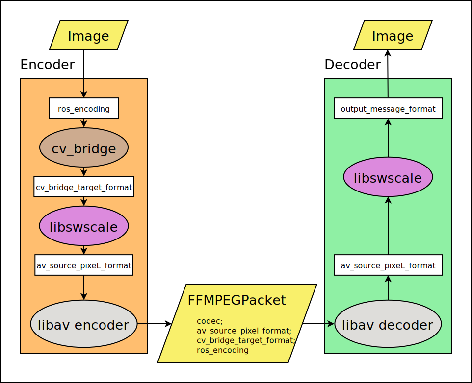

# ROS2 FFMPeg encoder/decoder

This ROS2 package supports encoding/decoding with the FFMpeg
library, for example encoding h264 and h265 or HEVC, using
Nvidia or other hardware acceleration when available.
This package is meant to be used by image transport plugins like
the [ffmpeg image transport](https://github.com/ros-misc-utilities/ffmpeg_image_transport/)
and the [foxglove compressed video transport](https://github.com/ros-misc-utilities/foxglove_compressed_video_transport/).

## Supported systems

Continuous integration is tested under Ubuntu with the following ROS2 distros:

 [](https://build.ros2.org/job/Hdev__ffmpeg_encoder_decoder__ubuntu_jammy_amd64/)
 [](https://build.ros2.org/job/Jdev__ffmpeg_encoder_decoder__ubuntu_noble_amd64/)
 [](https://build.ros2.org/job/Kdev__ffmpeg_encoder_decoder__ubuntu_noble_amd64/)
 [](https://build.ros2.org/job/Rdev__ffmpeg_encoder_decoder__ubuntu_noble_amd64/)


## Installation

### From packages

```bash
sudo apt-get install ros-${ROS_DISTRO}-ffmpeg-encoder-decoder
```

### From source

Set the following shell variables:
```bash
repo=ffmpeg_encoder_decoder
url=https://github.com/ros-misc-utilities/${repo}.git
```
and follow the [instructions here](https://github.com/ros-misc-utilities/.github/blob/master/docs/build_ros_repository.md)

Make sure to source your workspace's ``install/setup.bash`` afterwards.

## API overview

### Preliminaries
When using libav it is important to understand the difference between the encoder and the codec.
The *codec* is the standardized format in which images are encoded, for instance ``h264`` or ``hevc``.
The *encoder* is a libav software module that can encode images for a given codec. For instance ``libx264``, ``libx264rgb``,
 `h264_nvenc``, and ``h264_vaapi`` are all *encoders* that encode for the *codec* h264.
Some of the encoders are hardware accelerated, some can handle more image formats than others, but in the end they all encode video for a specific codec.

For the many AV options available for various libav encoders, and for ``qmax``, ``bit_rate`` and similar settings please refer to the ffmpeg documentation.

### The inner workings


The diagram above shows the stations that a ROS Image message passes as it traverses the encoder and decoder.
1) The ROS image (with [ROS sensor\_msgs/Image encoding](https://github.com/ros2/common_interfaces/blob/a2ef867438e6d4eed074d6e3668ae45187e7de86/sensor_msgs/include/sensor_msgs/image_encodings.hpp)) is first converted with the ROS [cv\_bridge](https://github.com/ros-perception/vision_opencv) into the ``cv_bridge_target_format``.
 This conversion is necessary because some ROS encodings (like bayer images) are not supported by libswscale.
 The ``cv_bridge_target_format`` can be set via ``setCVBridgeTargetFormat(const std::string & fmt)``.
 If this format is not set explicitly the image will be converted to the default format of ``bgr8``.
 This may not be what you want for e.g. ``mono8`` (gray) or Bayer images.
 Ideally the``cv_bridge_target_format`` can be directly used by the libav decoder so the next step becomes a no-op.
 But at the very least ``cv_bridge_target_format`` must be an acceptable libswscale input format (with the exception of
 special hacks for encoding single-channel images, see below).
2) The image is then converted to ``av_source_pixel_format`` using libswscale.
 The ``av_source_pixel_format`` can be set with ``setAVSourcePixelFormat()``, defaulting to something that is acceptable to the libav encoder.
 You can use ffmpeg (``ffmpeg -h encoder=libx264 | grep formats``) to list all formats that an encoder supports.
 Note that the ffmpeg/libav format string notation is different from the ROS encoding strings, and the ``av_source_pixel_format`` is specified using the libav convention, whereas the ``cv_bridge_target_format`` uses ROS convention!
 (If you choose to bypass the cv\_bridge conversion from step 1 by feeding the images to the encoder directly via the ``encodeImage(const cv::Mat & img ...)`` method, you must still set the ``cv_bridge_target_format`` such that the encoder knows what format the ``img`` argument has.)
 When aiming for lossless compression, beware of any ``av_source_pixel_format`` that reduces the color resolution, such as ``yuv420p``, ``nv12`` etc.
 For Bayer images, use the special hack for single-channel images.

3) The libav encoder encodes the packet with its supported codec, e.g. the ``libx264`` will produce ``h264`` packets.
 The ``encoding`` field of the FFMPEGPacket message will document all image format conversions and the codec, in reverse order, separated by semicolon.
 This way the decoder can attempt to reproduce the original ``ros_encoding``.

4) The libav decoder decodes the packet into the original ``av_source_pixel_format``.

5) Finally the image is converted to ``output_message_format`` using libswscale.
 This format can be set (in ROS encoding syntax!) with ``setOutputMessageEncoding()``.
 The format must be supported by both ROS and libswscale (except when using the special hack for single-channel images).

Note that only very few combinations of libav encoders, ``cv_bridge_target_format`` and ``av_source_pixel_format`` have been tested. Please provide feedback if you observe crashes or find obvious bugs. PRs are always appreciated!

### The special single-channel hack

Many libav encoders do not support single-channel formats (like mono8 or bayer).
For this reason a special hack is implemented in the encoder that adds an empty (zero-value) color channel to the single-channel image.
Later, the decoder removes it again.
To utilitze this hack, specify a ``cv_bridge_target_format`` of e.g. ``bayer_rggb8``. Without the special hack, this would trigger an error because Bayer formats are not acceptable to libswscale.
Instead, the image is converted to ``yuv420p`` or ``nv12`` by adding an empty color channel.
These formats are acceptable to most encoders.
The decoder in turn recognizes that the ``cv_bridge_target_format`` is a single-channel format, but ``yuv420p``/``nv12`` are not, and therefore drops the color channel.
This hack greatly improves the efficiency for lossless encoding of Bayer images because it avoids conversion to full RGB and back. 

## API usage

### Encoder

Using the encoder involves the following steps:
- instantiating the ``Encoder`` object.
- setting properties like the libav encoder to use, the encoding formats, and AV options.
- initializing the encoder object. This requires knowledge of the image size and therefore
  can only be done when the first image is available. Note that many properties
  (encoding formats etc) must have been set *before* initializing the encoder.
- feeding images to the encoder (and handling the callbacks when encoded packets become available)
- flushing the encoder (may result in additional callbacks with encoded packets)
- destroying the ``Encoder`` object.

The ``Encoder`` class API description has a short example code snippet.

### Decoder

Using the decoder involves the following steps:
- instantiating the ``Decoder`` object.
- if so desired, setting the ROS output (image encoding) format.
- initializing the decoder object. For this you need to know the encoding (codec, e.g. "h264"),
  and you have to specify the libav decoder name (e.g. "h264_cuvid").
- feeding encoded packets to the decoder (and handling the callbacks
  when decoded images become available)
- flushing the decoder (may result in additional callbacks with decoded images)
- destroying the ``Decoder`` object.
The ``Decoder`` class description has a short example code snippet.

## How to use a custom version of libav (aka ffmpeg)

Compile *and install* ffmpeg. Let's say the install directory is
``/home/foo/ffmpeg/build``, then for it to be found while building,
run colcon like this:
```
colcon build --symlink-install --cmake-args --no-warn-unused-cli -DFFMPEG_PKGCONFIG=/home/foo/ffmpeg/build/lib/pkgconfig -DCMAKE_BUILD_TYPE=RelWithDebInfo 
```

This will compile against the right headers, but at runtime it may
still load the system ffmpeg libraries. To avoid that, set
``LD_LIBRARY_PATH`` at runtime:
```
export LD_LIBRARY_PATH=/home/foo/ffmpeg/build/lib:${LD_LIBRARY_PATH}
```

### How to use ffmpeg hardware accelerated encoding on the NVidia Jetson

Follow the instructions
[here](https://github.com/Keylost/jetson-ffmpeg) to build a version of
ffmpeg that supports NVMPI. This long magic line should build a nvmpi enabled
version of ffmpeg and install it under ``/usr/local/``:
```
git clone https://github.com/berndpfrommer/jetson-ffmpeg.git && cd jetson-ffmpeg && mkdir build && cd build && cmake -DCMAKE_INSTALL
_PREFIX:PATH=/usr/local .. && make install && ldconfig && cd ../.. && git clone git://source.ffmpeg.org/ffmpeg.git -b release/7.1 --
depth=1 &&cd jetson-ffmpeg && ./ffpatch.sh ../ffmpeg && cd ../ffmpeg && ./configure --enable-nvmpi --enable-shared --disable-static 
--prefix=/usr/local && make install
```

Then follow the section above on how to
actually use that custom ffmpeg library. As always first test on the
CLI that the newly compiled ``ffmpeg`` command now supports ``h264_nvmpi``.

## License

This software is issued under the Apache License Version 2.0.
